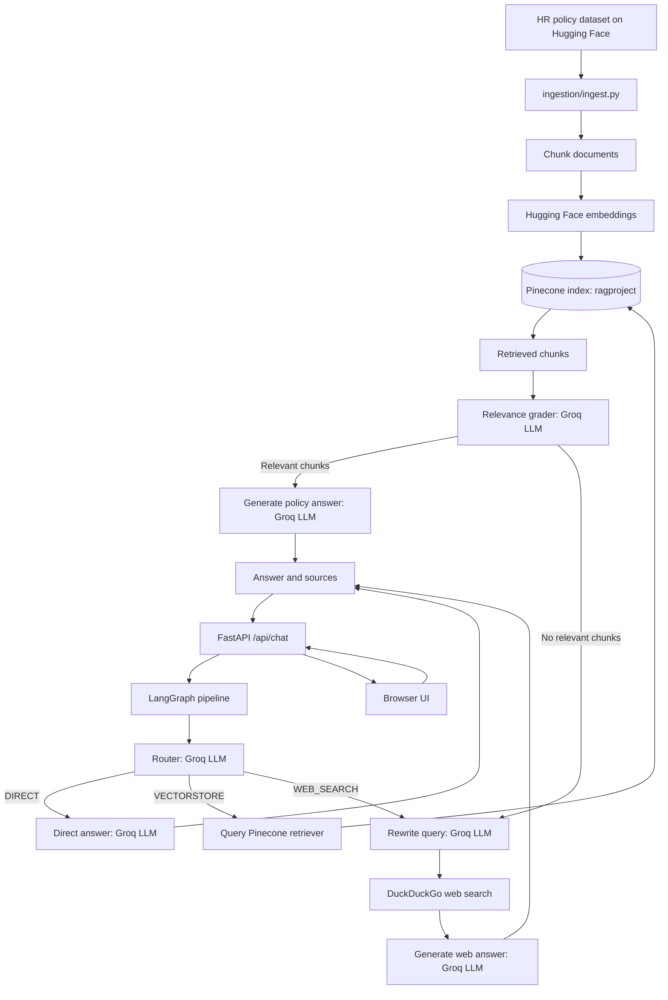

# RAG Project

This project is a retrieval-augmented generation assistant for HR and company-policy questions. It supports:

- vector retrieval from Pinecone
- routing between vector search, web search, and direct answers
- a LangGraph pipeline for orchestration
- a simple FastAPI web interface

## Project structure

- `sample_docs/` — example documents used for ingestion
- `ingestion/ingest.py` — loads documents into the Pinecone vector index
- `retreiver/rag.py` — retriever and LLM integration
- `retreiver/grader.py` — grades retrieved chunks for relevance
- `routing/routed.py` — routing logic for vector search, web search, or direct replies
- `graph.py` — LangGraph-based orchestration flow
- `webapp/server.py` — FastAPI backend and frontend serving
- `requirements.txt` — Python dependencies

## Architecture



The web app uses `graph.py` as its orchestration entry point. The CLI modules
in `routing/routed.py`, `generation/gen.py`, and `retreiver/grader.py` expose
similar standalone flows but are not called by `webapp/server.py`.

## Setup

1. Create and activate a virtual environment

```bash
python -m venv venv
venv\Scripts\Activate.ps1
```

2. Install dependencies

```bash
pip install -r requirements.txt
```

3. Create a `.env` file with the required API keys

```env
PINECONE_API_KEY=your-pinecone-api-key
GROQ_API_KEY=your-groq-api-key
# Optional: override the Groq model used by the app
GROQ_MODEL=openai/gpt-oss-20b
```

## Run the project

### Build the vector index

```bash
python ingestion/ingest.py
```

This loads the sample dataset and stores embeddings in Pinecone.

### Run the CLI assistant

```bash
python graph.py
```

### Run the web app

```bash
uvicorn webapp.server:app --reload
```

Then open the local URL shown by Uvicorn in your browser.

## Notes

- The app uses Pinecone for vector storage, Hugging Face embeddings, and Groq for generation.
- If the Pinecone index is missing or empty, run the ingestion step first.
- The routing layer can choose between internal policy retrieval, live web search, or a direct answer when no lookup is needed.
